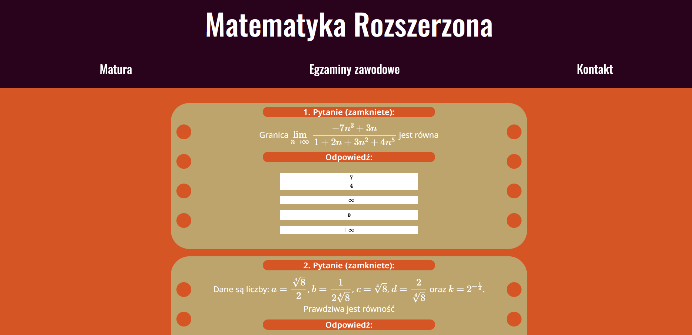
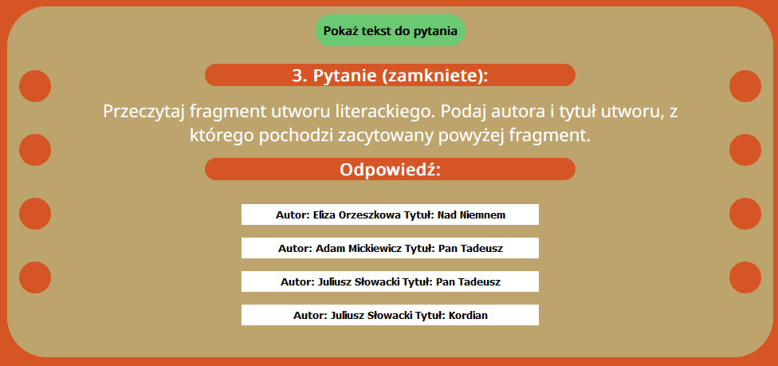

# About The Project
Website built using Django, for students who wants to practice for secondary school final examinations in Poland.
It contains questions from previous years tests. You can choose if you want to solve test from previous years, generate new test or answer just one question.

# Screenshots of website

